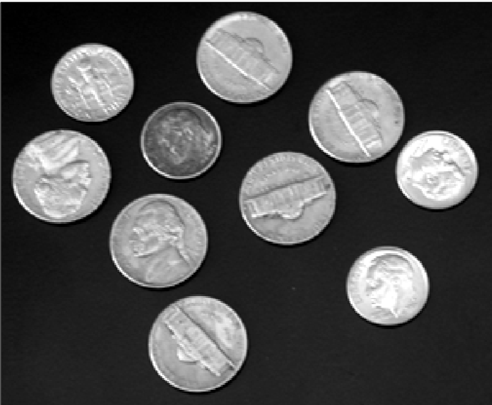
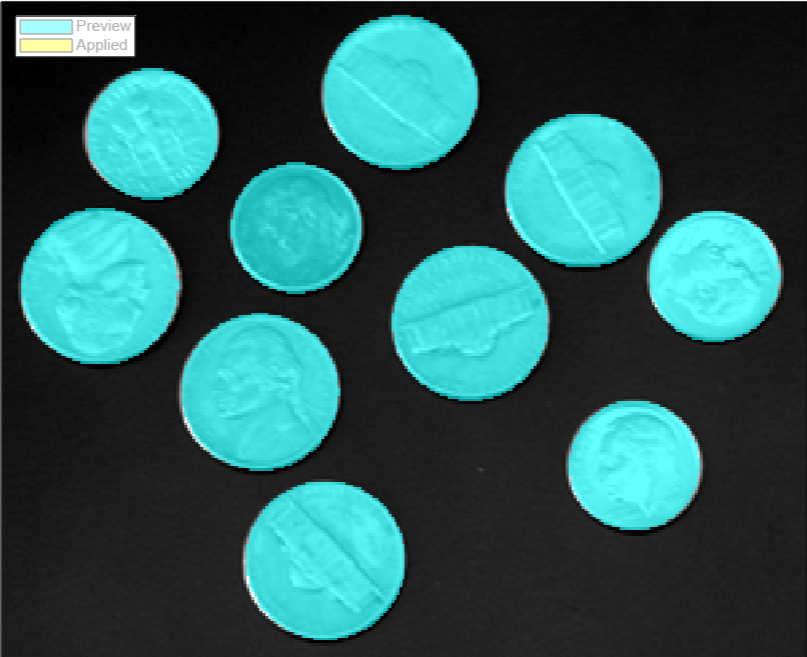

# Relatório sobre Tarefas de Processamento de Imagem
## I. Introdução
Este relatório tem o objetivo de descrever duas tarefas de processamento de imagem, abordando seu significado, aplicações e teste de produtos comerciais.

## II. Discussão
### 2.1 Segmentação
A segmentação de imagem envolve a divisão de uma imagem em partes ou regiões significativas e com características semelhantes buscando simplificar a representação da imagem ou torná-la mais fácil de analisar. As regiões segmentadas correspondem a diferentes objetos ou características da imagem, facilitando processos como reconhecimento de objetos e análise quantitativa. 

#### 2.1.1 Aplicações
Algumas aplicações são:
- Diagnóstico médico, como identificação de tumores em imagens.
- Identificação de talhões em imagens de satélite para medição de produtividade e classificação de culturas.
- Automação industrial para inspeção de produtos em linhas de montagem.
- Veículos autônomos, permite que carros autônomos evitem obstáculos como pedestres e outros carros, além de identificar faixas e sinais de trânsito.

#### 2.1.2 Produtos e segmentos de mercado
- Adobe Photoshop (segmento de design gráfico e edição de imagens)
- MATLAB Image Processing Toolbox (segmento acadêmico e de pesquisa, mas pode ser utilizado em diferentes aplicações)

### 2.2 Redução de ruído
A redução de ruído em imagens é o processo de remover elementos indesejados da imagem, que podem ocorrer devido a condições de iluminação inadequadas, problemas na câmera, ou interferência externa durante a captura da imagem. A meta é melhorar a qualidade visual da imagem sem perder detalhes importantes.

#### 2.1.1 Aplicações
Algumas aplicações são:
- Melhoria de imagens astronômicas para melhor visualização e análise de corpos celestes.
- Restauração de fotografias antigas ou danificadas.
- Melhoria de qualidade em videoconferências.
- Sistemas de segurança para clarear imagens capturadas em condições desfavoráveis.

#### 2.1.2 Produtos e segmentos de mercado
- Topaz Denoise AI (segmento de fotografia e vídeo)
- MATLAB Image Processing Toolbox (segmento acadêmico e de pesquisa, mas pode ser utilizado em diferentes aplicações)

### 2.2 Teste
Nesta seção será discutido os resultados obtidos testando o MATLAB Image Processing Toolbox para segmentação de imagens. Foi utilizado a função específica de segmentação "Find Circles", que segmenta círculos na imagem.

Imagem original:  
 
Imagem segmentada: 

É possível perceber que todas as moedas foram devidamente identificadas e segmentadas. A imagem é simples, porém mostra de forma eficaz como funciona o processo de segmentação.

## III. Conclusão
Este relatório mostra duas tarefas no processamento de imagens e suas aplicações na vida real. O teste de um dos produtos foi bem-sucedido e ilustra o processo de segmentação.
